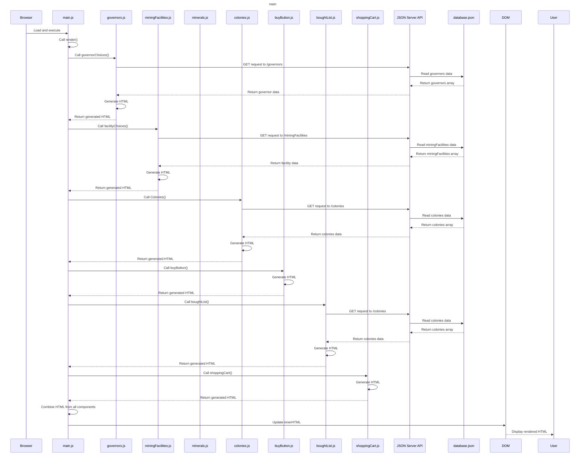
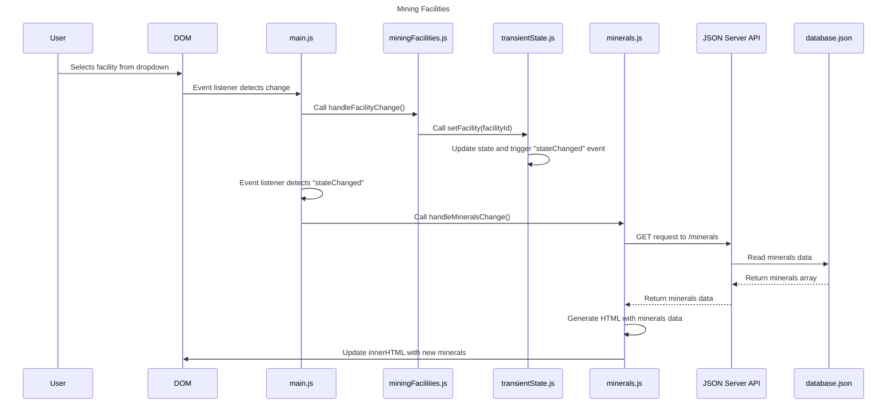
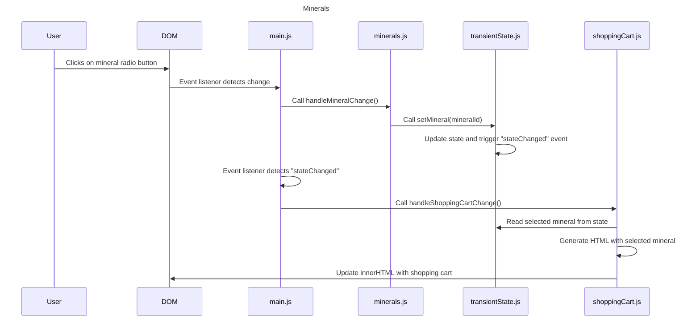
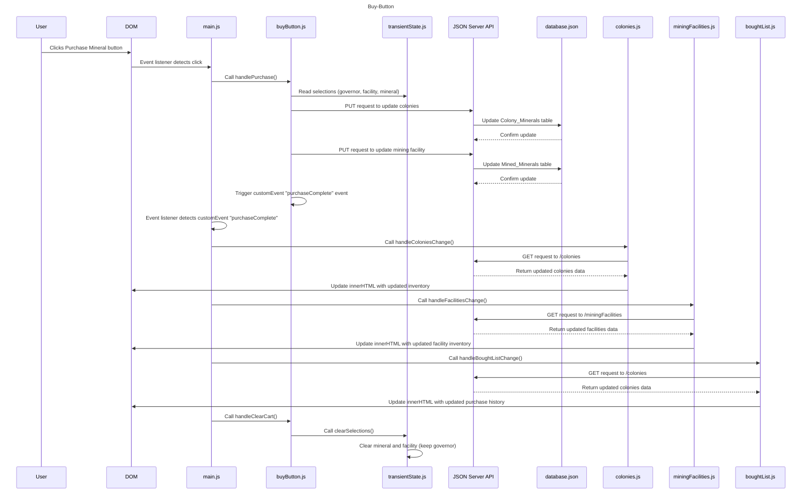

-----------------------------------------------------
-----------------------------------------------------
-----------------------------------------------------

 ```mermaid

 sequenceDiagram

    Title: Governors Sequence
   
    participant User
    participant DOM
    participant main.js
    participant governors.js
    participant transientState.js
    participant colonies.js
    participant API as JSON Server API
    participant DB as database.json

    User->>DOM: Selects governor from dropdown
    DOM->>main.js: Event listener detects change
    main.js->>governors.js: Call handleGovernorChange()
    governors.js->>transientState.js: Call setGovernor(governorId)
    transientState.js->>transientState.js: Update state and trigger "stateChanged" event
    main.js->>main.js: Event listener detects "stateChanged"
    main.js->>colonies.js: Call handleColoniesChange()
    colonies.js->>API: GET request to /colonies
    API->>DB: Read colonies data
    DB-->>API: Return colonies array
    API-->>colonies.js: Return colonies data
    colonies.js->>colonies.js: Generate HTML with colonies data
    colonies.js->>DOM: Update innerHTML with new colonies


```

-----------------------------------------------------
-----------------------------------------------------
-----------------------------------------------------




-----------------------------------------------------
-----------------------------------------------------
-----------------------------------------------------


-----------------------------------------------------
-----------------------------------------------------
-----------------------------------------------------

